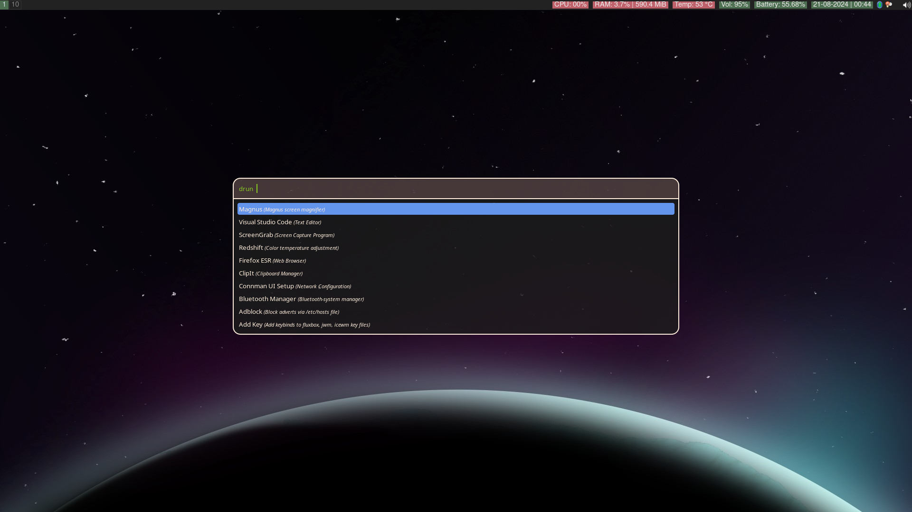
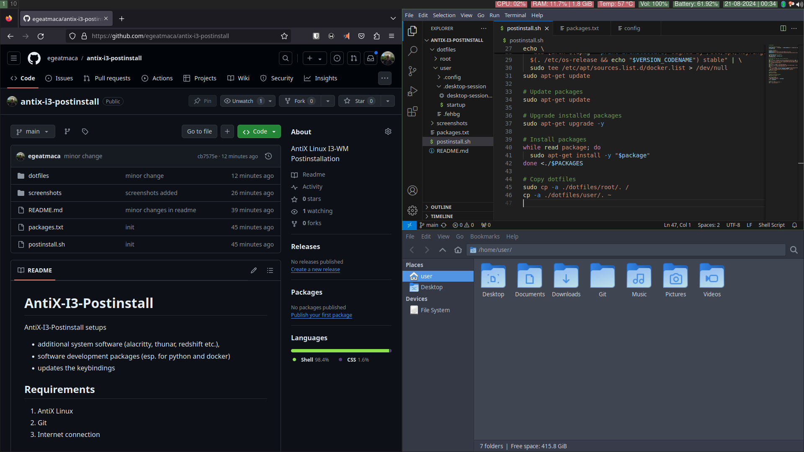

# AntiX-I3-Postinstall
AntiX-I3-Postinstall setups 
- additional system software (alacritty, thunar, redshift etc.),
- software development packages (esp. for python and docker)
- updates the keybindings

## Requirements
1. AntiX Linux
2. Git
3. Internet connection

## Run Post-Installation Script
1. Open a terminal
2. <code> git clone https://github.com/egeatmaca/antix-i3-postinstall.git </code> 
3. <code> /bin/bash antix-i3-postinstall/postinstall.sh </code>

## Screenshot

